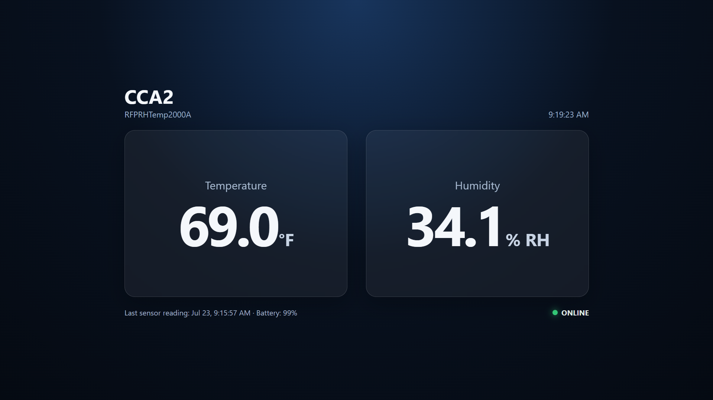

# MadgeTech-Live-Dashboard
A real-time environmental monitoring dashboard that displays temperature, humidity, pressure, and device status from MadgeTech Cloud. Built for continuous monitoring on a dedicated display in an office environment.

## Dashboard Preview

## Features

- Live temperature monitoring
- Live humidity monitoring
- Atmospheric pressure monitoring
- Battery level display
- Device connection status
- Automatic data refresh
- Alarm detection with visual alerts
- Responsive dashboard for dedicated displays

## Technologies Used

- Python
- Flask
- HTML5
- CSS3
- JavaScript
- MadgeTech Cloud API

## How It Works

1. The backend authenticates with the MadgeTech Cloud API.
2. Live sensor data is retrieved from connected devices.
3. Flask serves the latest data to the frontend.
4. The dashboard automatically refreshes to display the newest readings.
5. Alarm conditions are highlighted to quickly notify users.

## Deployment

The dashboard is deployed on a dedicated Windows mini PC connected to a monitor for continuous environmental monitoring.

Deployment features include:

- Automatically launches on system startup using Windows Task Scheduler
- Starts the Flask backend without user interaction
- Automatically opens Microsoft Edge in kiosk mode
- Displays the dashboard full-screen for uninterrupted monitoring
- Designed for 24/7 operation with automatic recovery after system restarts

## Project Purpose

This project was developed during my IT internship at Swift Engineering to provide employees with a dedicated display for monitoring environmental sensor data in real time. The dashboard makes important environmental information continuously visible.

## Installation

Clone the repository

git clone https://github.com/zerakayoub/madgetech-live-dashboard.git

Install dependencies

pip install -r requirements.txt

Fill in the .env.example file and remove the .example extension

Run

python app.py

## License

MIT License
